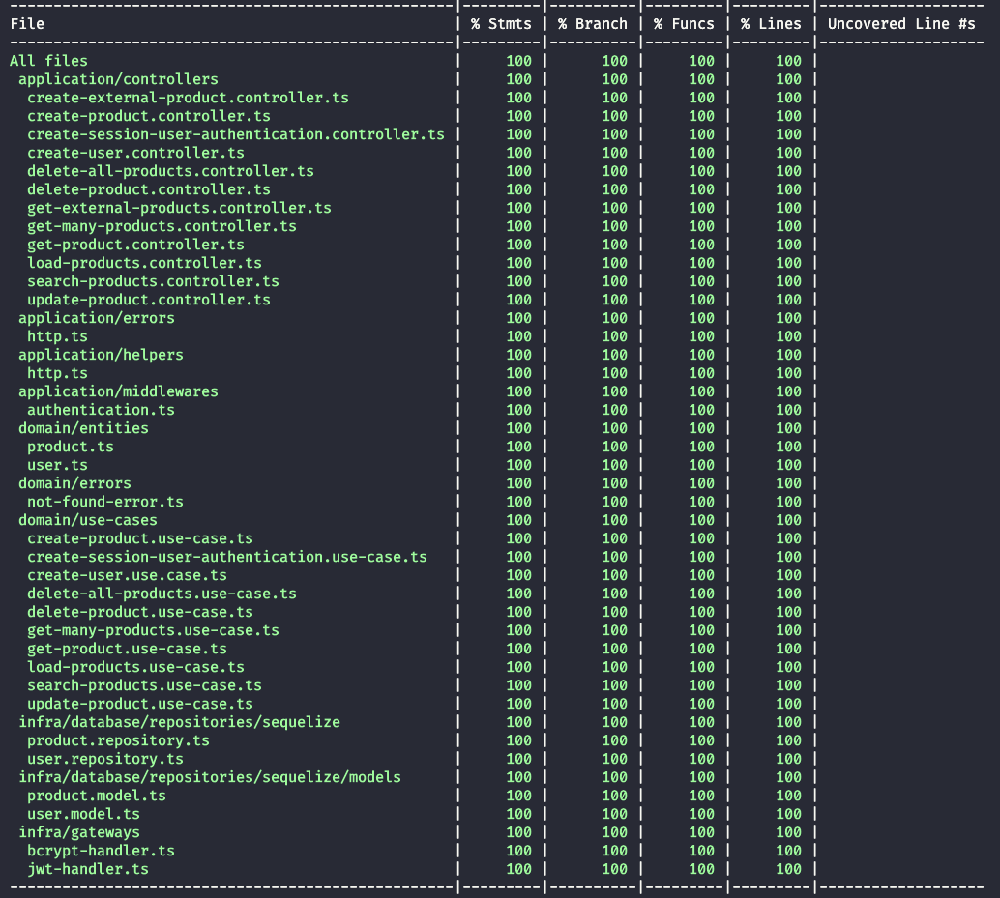

## **Sobre API**

Essa API faz parte de um desafio proprosto pela empresa Lexart, onde o objetivo é criar uma API para gerenciar produtos, que poderá ser consumida por um client que foi feito em React JS.  

[Acesse o cliente web aqui](https://challange-lexart-node-web.vercel.app/)

### **Arquitetura**

A arquitetura utilizada foi a clean architecture, onde a API é dividida em 4 camadas, sendo elas:  

- **Domain**: Camada onde fica as regras de negócio da aplicação, e as interfaces que serão implementadas nas outras camadas. Essa camada tambem conta com os casos de uso **(Use Cases)**, que são as classes que implementam as interfaces da camada domain, e que são responsáveis por fazer a comunicação entre as camadas.
- **Infra**: Camada onde fica a implementação das interfaces da camada domain, e onde fica a lógica de acesso a dados. Aqui e onde fazemos integrações com banco de dados, e com outras APIs.
- **Application**: Camada onde fica a implementação dos controllers, e onde fica a lógica de comunicação com o usuário. Aqui é onde fazemos as validações de dados, e onde fazemos a comunicação com a camada de domain.
- **Main**: Camada onde fica a implementação do servidor, e onde fica a lógica de inicialização da aplicação. Aqui é onde fazemos a injeção de dependências, e onde fazemos a comunicação com a camada de application.
   

 

### **Mais detalhes sobre o projeto e tomadas de decisões** [detalhes](./details/text.txt)

### **APIs construídas**

1. [Adicionar produto](./create-product.md)
2. [Adicionar produto externo](./create-product.md)
3. [Listar produtos](./list-products.md)
4. [Listar produtos externos](./list-products.md)
5. [Atualizar produto](./update-product.md)
6. [Deletar produto](./delete-product.md)
7. [Buscar com filtros de produto](./search-products.md)
8. [Carregar produtos (50)](./load-products.md)
9. [Deletar produtos](./load-products-scheduled.md)
10. [Buscar produtos deletados](./search-deleted-products.md)
11. [Registrar usuario](./register-user.md)
12. [Login usuario](./login-user.md)

### Rotas expostas para pedidos externos [Swagger](https://challange-lexart-node-api.vercel.app/api/docs/)

 

### **Tecnologias utilizadas**

- **NodeJS**: Linguagem de programação utilizada para desenvolver a API.
- **Typescript**: Linguagem de programação utilizada para desenvolver a API.
- **Express**: Framework utilizado para desenvolver a API.
- **Jest**: Framework utilizado para desenvolver os testes unitários.
- **Eslint**: Ferramenta utilizada para fazer a padronização do código.
- **Husky**: Ferramenta utilizada para fazer a padronização do código.
- **Postgres**: Banco de dados utilizado para armazenar os dados da aplicação.
- **Sqlite**: Banco de dados utilizado para fazer os testes de integração.
- **Sequelize**: Biblioteca utilizada para fazer a conexão com o banco de dados.
- **Vercel**: Plataforma utilizada para fazer o deploy da aplicação.
- **JWT**: Biblioteca utilizada para fazer a autenticação dos usuários.
- **Bcrypt**: Biblioteca utilizada para fazer a criptografia das senhas.
- **Swagger**: Biblioteca utilizada para fazer a documentação da API.

 

### **Princípios utilizados**

- **SRP**: Single Responsibility Principle
- **OCP**: Open Closed Principle
- **LSP**: Liskov Substitution Principle
- **ISP**: Interface Segregation Principle
- **DIP**: Dependency Inversion Principle
- **YAGNI**: You Aren't Gonna Need It
- **Small Commits**: Commits Pequenos
- **Messages and Events**: Mensagens e Eventos
- **CQRS**: Command Query Responsibility Segregation
- **KISS**: Keep It Simple, Stupid
- **DRY**: Don't Repeat Yourself

 

### **Design Patterns**

- **Adapter**: Padrão utilizado para fazer a comunicação entre a camada de routes e a camada de controllers. (ExpressRouterAdapter)
- **Decorator**: Padrão utilizado para fazer a validação de dados. (Validation)
- **Factory**: Padrão utilizado para fazer a injeção de dependências. (ControllerFactory)
- **Singleton**: Padrão utilizado para fazer a conexão com o banco de dados. (MongoHelper)
- **Observer**: Padrão utilizado para fazer a manipulação de eventos. (EventEmitter)
- **Command**: Padrão utilizado para as implementações dos casos de uso. (UseCase)
- **Proxy**: Padrão utilizado para fazer a comunicação entre as camadas. (UseCaseProxy)

 

### **Metodologias e Designs**

- **Clean Architecture**
- **TDD**
- **Clean Code**
- **Conventional Commits**
- **Use Cases**
- **SOLID**
- **Dependency Injection**
- **Inversion of Control**
- **Separation of Concerns**

 

### **Features de Testes**

- **Testes Unitários**
- **Testes de Integração**
- **Test End-to-End**
- **Mock**
- **Spy**

 

### **Como rodar a aplicação**

1. Clone o repositório
2. Instale as dependências com `npm run install` ou `npm ci` !Importante: Precisa ter um banco de dados postgres rodando localmente ou em um container docker.
3. Mude as variaveis de ambiente no arquivo `.env-example` para suas configurações locais.
4. Rode a aplicação com `npm run start:dev` ou `npm start`
5. Acesse a aplicação em `http://localhost:3000`

 

### **Como rodar os testes**

1. Clone o repositório
2. Instale as dependências com `npm run install` ou `npm ci`
3. Rode os testes com `npm run test:cov` !importante: os testes de integracao estao com um bug para rodar no container, pois a imagem do node usada nao e compativel com a lib que roda os testes de integração. Porém localmente funciona normalmente.

 

### **Como rodar as seeds**

1. Clone o repositório
2. Instale as dependências com `npm run install` ou `npm ci`
3. Rode a aplicação com docker `npm run docker:up`
4. Rode o comando `seed:run` para rodar as seeds

 

### **Contatos**
  

  <kbd>
  

  <kbd>Sociais</kbd>
  

 
 
 
 

</kbd>

